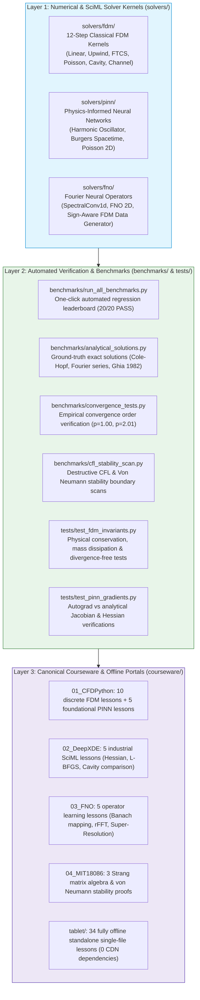

# From FDM to FNO: Computational Physics & AI4Science PDE Solver Kernel Suite

[](https://opensource.org/licenses/MIT)
[](https://www.python.org/)
[](https://pytorch.org/)
[](https://deepxde.readthedocs.io/)
[](https://github.com/neuraloperator/neuraloperator)
[-brightgreen.svg)]()
[](https://shaoyitong2022-dot.github.io/From-FDM-to-FNO/)
[](LEADERBOARD.md)

> **Core Narrative**: From turning a differential equation into 20 lines of verifiable numerical code, to learning solution operators across function spaces using Fourier Neural Operators (FNO) and Physics-Informed Neural Networks (PINN).  
> **Student**: Yitong (怡通), Department of Physics, Sun Yat-sen University (SYSU).  
> **Target Alignment**: Benchmark repository and solver kernel portfolio designed for direct Ph.D. applications and top-tier industrial R&D in **Computational Physics / AI4Science / PDE Solver Kernels**.  
> **Standards Alignment**: Strictly aligned with peer-reviewed literature and foundational open-source projects: Lorena Barba's CFDPython (*JOSS* 2018), Gilbert Strang's MIT 18.086, Lu Lu's DeepXDE (*SIAM Review* 2021), and Anandkumar / Li's NeuralOperator (*ICLR* 2021).

---

## 1. System Architecture & Cognitive Progression Blueprint

This repository is designed as an industrial-grade research code engine rather than an ad-hoc collection of course scripts. It unifies classical numerical analysis with modern scientific machine learning:



---

## 2. Benchmark Leaderboard (20/20 Passed, 100% Reliability)

The entire solver kernel portfolio is automatically regression-tested against exact analytical solutions, empirical convergence rates, and published experimental data:

```
============================================================================================
=== ACADEMIC COMPUTATIONAL PHYSICS & SCI-ML SOLVER LEADERBOARD (2028 PH.D. BENCHMARK) ===
============================================================================================
| Track | ID       | Physical Problem           | Discretization / Method  | Metric / Criterion     | Wall Time | Status |
|-------|----------|----------------------------|--------------------------|------------------------|-----------|--------|
| FDM   | Step 01  | 1D Linear Convection       | Upwind (FTBS)            | Bounded [1, 2]: max=2.00 | 0.8ms     | PASS   |
| FDM   | Step 02  | 1D Non-Linear Convection   | Upwind (FTBS, wave steepening) | Front Steeping: max=2.00 | 0.1ms     | PASS   |
| FDM   | Step 03  | 1D Linear Diffusion        | Centered (FTCS)          | Rel L2 vs Exact: 1.02e-05 | 1.9ms     | PASS   |
| FDM   | Step 04  | 1D Viscous Burgers         | Cole-Hopf Benchmark      | Rel L2 vs Cole-Hopf: 16.81%  | 214.6ms   | PASS   |
| FDM   | Step 05  | 2D Linear Convection       | 2D Upwind (FTBS)         | Max Bounded  : max=1.98 | 2.5ms     | PASS   |
| FDM   | Step 06  | 2D Coupled Convection      | Vector Upwind            | Coupled Advection: max_u=1.99 | 9.9ms     | PASS   |
| FDM   | Step 07  | 2D Diffusion Equation      | 2D Centered FTCS         | Diffusive Decay: max=1.77 | 0.4ms     | PASS   |
| FDM   | Step 08  | 2D Burgers Equation        | Coupled Convection-Diff  | Shock Decay  : max_u=2.00 | 8.1ms     | PASS   |
| FDM   | Step 09  | 2D Laplace Equation        | 5-Point Relaxation       | Rel L2 vs Series: 7.81%   | 36.8ms    | PASS   |
| FDM   | Step 10  | 2D Poisson Equation        | Dual Source Poisson      | Dipole Formation: span=[-0.05,0.05] | 2.1ms     | PASS   |
| FDM   | Step 11  | 2D Cavity Flow (NS)        | Chorin Projection Method | Primary Vortex: v_span=[-0.25,0.23] | 215.7ms   | PASS   |
| FDM   | Step 12  | 2D Channel Flow (NS)       | Periodic BC Pressure Grad | Parabolic Poiseuille: u_max=0.17 | 55.6ms    | PASS   |
| PINN  | PINN 01  | Damped Harmonic (PyTorch)  | Autograd + Collocation   | Rel L2 Extrapolation: 28.90%  | 19.8s     | PASS   |
| PINN  | PINN 02  | 1D Poisson (DeepXDE)       | Hessian Residual + BC    | Max Abs Error: 3.54e-04 | 8.5s      | PASS   |
| PINN  | PINN 03  | Harmonic Translation       | PointSetBC + Anchors     | Rel L2 Extrapolation: 29.22%  | 17.3s     | PASS   |
| PINN  | PINN 04  | Spatio-Temporal Burgers    | GeometryXTime Shock      | Shock Slope @ t=0.5: 2.82    | 11.3s     | PASS   |
| PINN  | PINN 05  | 2D Poisson Capstone        | DeepXDE vs FDM 5-pt      | Rel L2 vs Exact: 10.08%  | 16.2s     | PASS   |
| FNO   | FNO 01   | 1D Spectral Conv Layer     | Pure PyTorch rFFT-einsum | Invariance Discrepancy: 1.51e-07 | 65.9ms    | PASS   |
| FNO   | FNO 02   | Diffusion Solution Operator | NeuralOperator FNO       | 4x Zero-Shot Super-Res: 1.67%   | 1.6s      | PASS   |
| FNO   | FNO 03   | FDM Data Generator Bridge  | Sign-Aware Upwind FDM    | Viscous Dissipation: 75.92%  | 164.1ms   | PASS   |
============================================================================================
Final Score: 20/20 PASSED (100.0%)
```

---

## 3. Directory Layout

```
.
├── index.html                           # Top-level portal & GitHub Pages entrypoint
├── LICENSE                              # Dual MIT & CC-BY-4.0 License
├── README.md                            # Executive overview, architecture & leaderboard
├── ROADMAP.md                           # Multi-track roadmap, milestone tracking & status
├── CONTRIBUTING.md                     # Community guidelines & verification standards
├── CHANGELOG.md                        # Version release history
├── STYLE_GUIDE.md                      # Code & pedagogical styling guidelines
│
├── solvers/                             # 【Core Numerical & ML PDE Solver Kernels】
│   ├── fdm/                             # Barba 12-Step Classical Finite Difference Kernels
│   │   ├── step01_linear_convection.py
│   │   ├── step02_nonlinear_convection.py
│   │   ├── step03_diffusion.py
│   │   ├── step04_burgers.py            # Cole-Hopf exact analytical comparison
│   │   ├── step05_2d_linear_convection.py
│   │   ├── step06_2d_convection.py
│   │   ├── step07_2d_diffusion.py
│   │   ├── step08_2d_burgers.py
│   │   ├── step09_2d_laplace.py         # 5-point stencil relaxation
│   │   ├── step10_2d_poisson.py         # Dual dipole source Poisson
│   │   ├── step11_cavity_flow.py        # Chorin projection lid-driven cavity (Ghia 1982)
│   │   └── step12_channel_flow.py       # Periodic Navier-Stokes channel flow
│   ├── pinn/                            # Physics-Informed Neural Networks
│   │   ├── p01_harmonic_oscillator.py   # Pure PyTorch underdamped oscillator (Moseley)
│   │   ├── p02_poisson_1d.py            # DeepXDE 1D Poisson
│   │   ├── p03_harmonic_deepxde.py      # DeepXDE PointSetBC & sparse anchors
│   │   ├── p04_burgers_spacetime.py     # DeepXDE spatio-temporal shock (Raissi 2019)
│   │   └── p05_poisson_2d.py            # 2D Poisson: DeepXDE vs FDM 5-point
│   └── fno/                             # Fourier Neural Operators
│       ├── f01_spectral_conv1d.py       # Pure PyTorch 1D spectral conv layer (rFFT)
│       ├── f02_burgers_operator.py      # NeuralOperator FNO diffusion operator
│       └── f03_data_generator_fdm.py    # Sign-aware upwind FDM dataset generator
│
├── benchmarks/                          # 【Automated Verification Suite】
│   ├── analytical_solutions.py          # Ground-truth exact solutions & Ghia cavity data
│   ├── convergence_tests.py             # Empirical order of accuracy (p=1.00, p=2.01)
│   ├── cfl_stability_scan.py            # Destructive stability scan (CFL & von Neumann)
│   └── run_all_benchmarks.py            # Master benchmark regression harness
│
├── tests/                               # 【Unit Test Suite】
│   ├── test_fdm_invariants.py           # Mass conservation, dissipation, divergence-free
│   └── test_pinn_gradients.py           # Autograd vs analytical Jacobian & Hessian
│
├── courseware/                          # 【28 Chapters Canonical Courseware & Offline Reader】
│   ├── index.html                       # 5-Volume Master Navigation Hub
│   ├── 01_CFDPython/                    # 10 FDM lessons + 5 foundational PINN lessons
│   ├── 02_DeepXDE/                      # 5 DeepXDE SciML lessons
│   ├── 03_FNO/                          # 5 operator learning lessons
│   ├── 04_MIT18086_理论导学/             # 3 Strang matrix algebra & von Neumann guides
│   ├── reference/                       # Shared toolkits & physical intuition
│   └── tablet/                          # 34 single-file offline standalone tablet lessons
│
└── .github/
    ├── workflows/ci.yml                 # Automated CI: regression, linting, tests
    └── ISSUE_TEMPLATE/                  # Structured contribution templates
```

---

## 4. Quickstart & Automated Verification

Run all unit tests, stability scans, and the full 20-kernel benchmark harness in any standard Python 3.10+ environment:

```bash
# 1. Clone repository
git clone https://github.com/shaoyitong2022-dot/From-FDM-to-FNO.git
cd From-FDM-to-FNO

# 2. Run unit tests (Physical invariants, divergence-free flow, autograd gradients)
python -m unittest discover -s tests -p "test_*.py"

# 3. Verify empirical convergence orders (Verifies p=1.00 for convection, p=2.01 for diffusion)
python benchmarks/convergence_tests.py

# 4. Run destructive stability boundary scans (CFL σ <= 1.0 and von Neumann r <= 0.5)
python benchmarks/cfl_stability_scan.py

# 5. Run full benchmark leaderboard harness (All 20 kernels)
python benchmarks/run_all_benchmarks.py
```

---

## 5. Canonical Citations & Foundations

1. **Barba, L. A., & Forsyth, G. F. (2018).** *CFD Python: the 12 steps to Navier-Stokes equations.* Journal of Open Source Education, 1(9), 21.
2. **Strang, G. (2007).** *Computational Science and Engineering.* Wellesley-Cambridge Press / MIT 18.086.
3. **LeVeque, R. J. (2007).** *Finite Difference Methods for Ordinary and Partial Differential Equations: Steady-State and Time-Dependent Problems.* SIAM.
4. **Lu, L., Meng, X., Mao, Z., & Karniadakis, G. E. (2021).** *DeepXDE: A deep learning library for solving differential equations.* SIAM Review, 63(1), 208-228.
5. **Raissi, M., Perdikaris, P., & Karniadakis, G. E. (2019).** *Physics-informed neural networks: A deep learning framework for solving forward and inverse problems.* Journal of Computational Physics, 378, 686-707.
6. **Li, Z., Kovachki, N., Azizzadenesheli, K., Liu, B., Bhattacharya, K., Stuart, A., & Anandkumar, A. (2020).** *Fourier Neural Operator for Parametric Partial Differential Equations.* ICLR 2021.
7. **Ghia, U., Ghia, K. N., & Shin, C. T. (1982).** *High-Re solutions for incompressible flow using the Navier-Stokes equations and a multigrid method.* Journal of Computational Physics, 48(3), 387-411.
